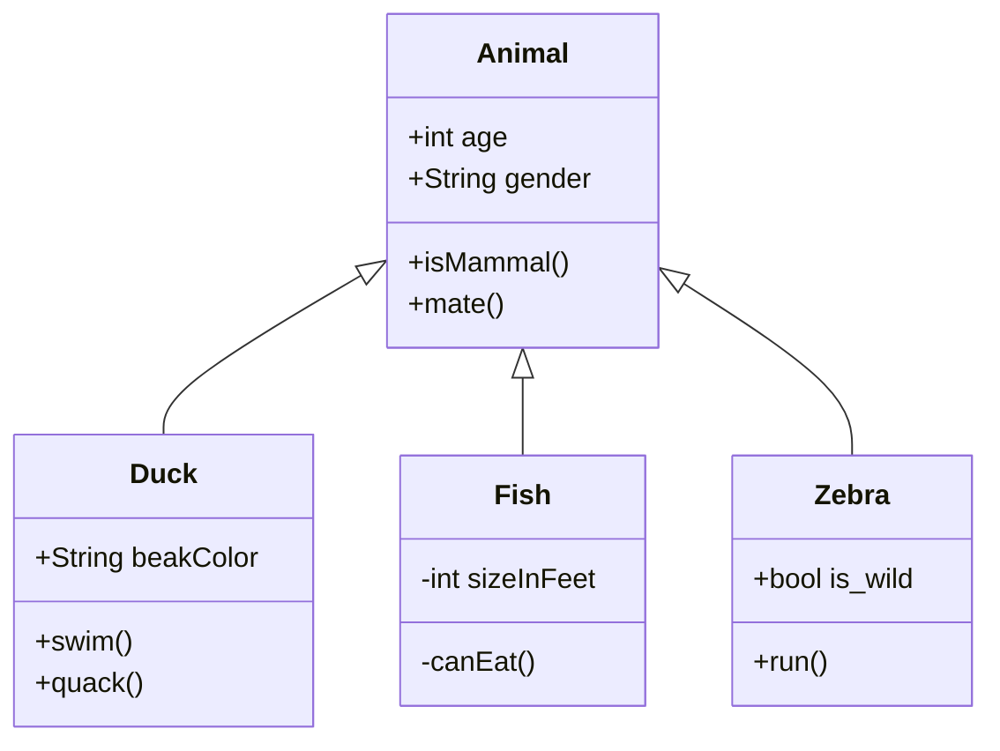

## User Story 2 

As Player 1, 
So I can win a game of Battle, 
I want to attack Player 2, and I want to get a confirmation

    Player_1    >>    attack    >>    Player_2

                          |
                          |
                          |
                          V

                confirmation of attack

setup feature test
click attack button
expect page to contain "confirmation of attack"